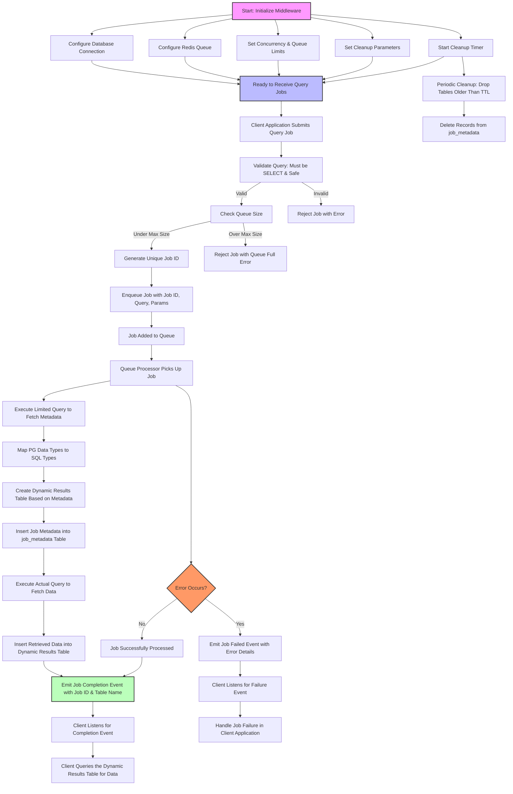

# DBSentinel


## Introduction

**DBSentinel** is a robust Node.js library designed to act as an intermediary layer between your application and your *PostgreSQL* database. It efficiently manages and queues database queries, ensuring optimal performance and preventing database overload. By handling expensive or resource-intensive queries asynchronously, it enhances the scalability and reliability of your applications.

## Features

- **Queue Management**: Aggregates and queues database queries to control load and prevent performance bottlenecks.
- **Concurrency Control**: Processes queries based on configurable concurrency limits, ensuring efficient resource utilization.
- **Dynamic Result Storage**: Creates dynamic tables tailored to each query's result schema, ensuring data integrity and uniqueness.
- **Automatic Cleanup**: Automatically drops result tables that are older than a configurable Time-To-Live (TTL) to maintain database hygiene.
- **Event-Driven Notifications**: Emits events upon job completion or failure, eliminating the need for inefficient polling mechanisms.
- **SQL Injection Prevention**: Validates and sanitizes queries, enforcing the use of parameterized queries to safeguard against SQL injection attacks.
- **Configurable Limits**: Allows setting maximum queue sizes to prevent system overloads.
- **TypeScript Support**: Fully compatible with TypeScript, providing strong typing and enhanced developer experience.

## Use Cases

- **Heavy Reporting Systems**: Offload intensive reporting queries to prevent slowing down the main application.
- **Batch Data Processing**: Manage and execute large batches of database operations efficiently.
- **Microservices Architecture**: Serve as a dedicated service for handling database interactions, promoting separation of concerns.
- **Background Task Management**: Handle background database tasks without impacting the responsiveness of the primary application.

## How It Works

1. **Initialization**: Configure the middleware with your database and Redis connection details, set concurrency limits, queue sizes, and cleanup parameters.
2. **Job Submission**: The client application submits SQL `SELECT` queries to the middleware, which validates and enqueues them.
3. **Queue Processing**: The middleware processes queued jobs based on the defined concurrency limits. It executes each query, creates a dynamic results table matching the query's schema, and inserts the fetched data.
4. **Event Emission**: Upon job completion or failure, the middleware emits corresponding events, allowing the client to react accordingly.
5. **Result Retrieval**: The client listens for completion events and queries the dynamically created results table to access the data.
6. **Automatic Cleanup**: The middleware periodically cleans up old result tables based on the configured TTL, ensuring the database remains optimized.

## Installation

```bash
npm install db-sentinel
```

## Configuration

To use DB Query Middleware, initialize it with the necessary configuration parameters:
```TypeScript
import { dbSentinel } from 'db-sentinel';

dbSentinel.initialize({
  db: {
    user: 'your_db_user',
    host: 'your_db_host',
    database: 'your_db_name',
    password: 'your_db_password',
    port: 5432,
  },
  queue: {
    redisHost: '127.0.0.1',
    redisPort: 6379,
    concurrency: 5,           // Number of concurrent jobs
    maxQueueSize: 100,        // Maximum number of queued jobs
  },
  cleanup: {
    tableTTLHours: 24,        // Time-to-live for result tables in hours
    cleanupIntervalMs: 3600000, // Interval for cleanup checks in milliseconds
  },
});
```

## Usage

1. **Initialize the Middleware** 
Ensure the middleware is initialized at the start of your application with the appropriate configuration.
```TypeScript
import { dbSentinel } from 'db-sentinel';

dbSentinel.initialize({
  db: { /* database config */ },
  queue: { /* queue config */ },
  cleanup: { /* cleanup config */ },
});
```

2. **Submit a Query Job**
Use the createQueryJob method to enqueue a SELECT query. Always use parameterized queries to enhance security.
```TypeScript
const jobId = await dbSentinel.createQueryJob(
  'SELECT id, name, created_at FROM users WHERE status = $1',
  ['active']
);
console.log('Job submitted with ID:', jobId);
```

3. **Listen for Job Completion or Failure**
Attach event listeners to handle job completion or failure events. This eliminates the need for polling and allows your application to react immediately.
```TypeScript
import { SENTINEL_JOB_COMPLETED, SENTINEL_JOB_FAILED } from 'db-sentinel';

dbSentinel.once(SENTINEL_JOB_COMPLETED(jobId), async (info) => {
  console.log('Job completed:', info);
  const tableName = await dbSentinel.getTableNameForJob(jobId);
  if (tableName) {
    const result = await fetchResultsFromTable(tableName);
    console.log('Query Results:', result);
  }
});

dbSentinel.once(SENTINEL_JOB_FAILED(jobId), (error) => {
  console.error('Job failed:', error);
});
```

4. **Fetch Results from the Dynamic Table**
After receiving the completion event, query the dynamically created table to retrieve the results.
```TypeScript
async function fetchResultsFromTable(tableName: string) {
  const poolClient = await dbSentinel.getDbPool().connect();
  try {
    const result = await poolClient.query(`SELECT * FROM "${tableName}"`);
    return result.rows;
  } finally {
    poolClient.release();
  }
}
```

5. **Graceful Shutdown**
Ensure the middleware is properly shut down when your application exits to close all connections and clean up resources.
```TypeScript
await dbSentinel.shutdown();
```

## Flow Chart



## Example

An example client demonstrating the middleware usage is provided in the exampleClient.ts file.
```TypeScript
import {
  dbSentinel,
  SENTINEL_JOB_COMPLETED,
  SENTINEL_JOB_FAILED
} from 'db-sentinel';

async function main() {
  dbSentinel.initialize({
    db: {
      user: 'postgres',
      host: 'localhost',
      database: 'testdb',
      password: 'password',
      port: 5432,
    },
    queue: {
      redisHost: '127.0.0.1',
      redisPort: 6379,
      concurrency: 2,
      maxQueueSize: 10,
    },
    cleanup: {
      tableTTLHours: 1,
      cleanupIntervalMs: 300000,
    },
  });

  try {
    const jobId = await dbSentinel.createQueryJob(
      'SELECT generate_series(1, 3) as id, $1 as note',
      ['Test Param']
    );

    dbSentinel.once(SENTINEL_JOB_COMPLETED(jobId), async (info) => {
      console.log('Job completed:', info);

      const tableName = await dbSentinel.getTableNameForJob(jobId);
      if (tableName) {
        const poolClient = await dbSentinel.getDbPool().connect();
        try {
          const result = await poolClient.query(`SELECT * FROM "${tableName}"`);
          console.log('Result from dynamic table:', result.rows);
        } finally {
          poolClient.release();
        }
      }
    });

    dbSentinel.once(SENTINEL_JOB_FAILED(jobId), (error) => {
      console.error('Job failed:', error);
    });
  } catch (error) {
    console.error('Error creating job:', error);
  }

  // Optional: Shutdown after some time for demonstration
  setTimeout(async () => {
    console.log('Shutting down middleware...');
    await dbSentinel.shutdown();
    process.exit(0);
  }, 20000);
}

main();
```

## API Reference

**initialize(config: MiddlewareConfig): void**
Initializes the middleware with the provided configuration.
1. Parameters:
    - config: Configuration object containing database, queue, and cleanup settings.

**createQueryJob(query: string, params?: any[]): Promise<string>**
Creates and enqueues a new SELECT query job.
1. Parameters:
    - query: The SQL SELECT query string with parameter placeholders.
    - params: Array of parameters to safely inject into the query.
2. Returns:
    - jobId: A unique identifier for the submitted job.

**getTableNameForJob(jobId: string): Promise<string | null>**
Retrieves the name of the dynamic results table associated with a specific job.
1. Parameters:
    - jobId: The unique identifier of the job.
2. Returns:
    - tableName: The name of the results table or null if not found.

**shutdown(): Promise<void>**
Gracefully shuts down the middleware, closing all connections and stopping background processes.

## Event Reference

**SENTINEL_JOB_COMPLETED(jobId: string)**
Emitted when a job completes successfully.
1. Payload:
    - jobId: The unique identifier of the completed job.
    - tableName: The name of the table containing the query results.

**SENTINEL_JOB_FAILED(jobId: string)**
Emitted when a job fails during processing.
1. Payload:
    - jobId: The unique identifier of the failed job.
    - error: The error details.

## Error Handling

1. **Queue Limits:** If the queue exceeds the maxQueueSize, new jobs are rejected with an appropriate error message.
2. **Query Validation:** Only SELECT queries without dangerous keywords or multiple statements are allowed. Attempts to submit invalid queries result in job rejection.
3. **Database Errors:** Any errors during query execution, table creation, or data insertion emit a JOB_FAILED event with error details.
4. **Cleanup Errors:** Errors during the cleanup process are logged but do not halt the cleanup timer.

## Security Considerations

1. **SQL Injection Prevention:** All queries must use parameterized inputs. The middleware enforces the use of SELECT statements and disallows potentially harmful SQL keywords.
2. **Query Validation:** Queries are validated to ensure they are safe and conform to allowed patterns before being processed.
3. **Access Control:** Ensure that only authorized parts of your application can submit queries to the middleware.

## Cleanup Strategy

The middleware automatically cleans up result tables that are older than the configured tableTTLHours. This process runs at intervals defined by cleanupIntervalMs, ensuring that the database remains optimized and free from stale data.

1. Configuration:
    - tableTTLHours: Specifies how long result tables should be retained.
    - cleanupIntervalMs: Defines how frequently the cleanup process runs.

## License

This project is licensed under the MIT License.

